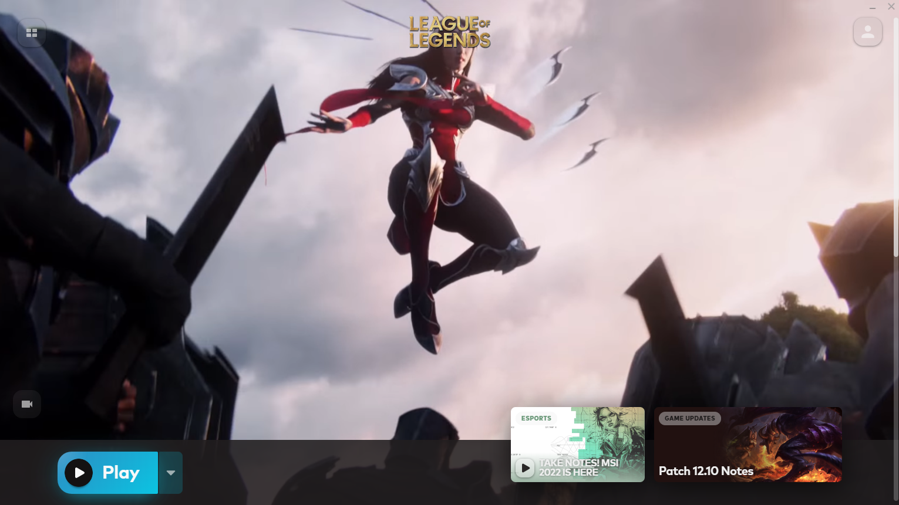

# Getting Started

## Introduction
To extract live game information, we need to access the Live Client Data API from Riot Games.

Estimated Lab Time: xx minutes

### Prerequisites

* An Oracle Free Tier, Paid or LiveLabs Cloud Account
* Active Oracle Cloud Account with available credits to use for Data Science service.

## Task 1: Live Client API - Connecting

The League Client API features a set of protocols that CEF (Chromium Embedded Framework) uses to communicate between the League of Legends process and a C++ library.


Communication between the CEF and this C++ library happen locally, so we're obligated to use localhost as our connection endpoint. You can find additional information about this communication [here](https://developer.riotgames.com/docs/lol).

You can also refer to [article 4](https://github.com/oracle-devrel/leagueoflegends-optimizer/blob/livelabs/articles/article4.py), where I explain the most interesting endpoints that we encounter when using the Live Client Data API.

For this article, we'll access the following HTTP endpoint:

    ```bash
    # GET https://127.0.0.1:2999/liveclientdata/allgamedata
    # Sample output can be found in the following URL, if interested. https://static.developer.riotgames.com/docs/lol/liveclientdata_sample.json
    # This endpoint encapsulates all other endpoints into one.
    ```

When we join a League of Legends game, the League process automatically opens port 2999. We'll use this to our advantage and we'll make recurring requests to localhost:2999 to extract live match information.

## Task 2: Testing the Live Client API

1. If you want to test the Live Client API, you'll need to join a League of Legends match:
    
2. After clicking on "play", we'll create a custom match and set to play against an AI bot:
    
3. Now, we'll add an AI bot to play against us in the enemy team and start the game. Afterwards, we'll be in the champion select screen, where we'll have the option to select any champion.
    
4. Now, we are inside the game after loading.
    
5. After joining the game, we can start making HTTP requests to check our live champion statistics, score, cooldowns, etc. [To make the requests automatically, you can use this code](https://github.com/oracle-devrel/leagueoflegends-optimizer/blob/livelabs/src/live_client_producer.py).

    [This is an example packet returned by the Live Client API](https://static.developer.riotgames.com/docs/lol/liveclientdata_sample.json) and we can observe the kind of information we can access from a player. I've attached the obtained sample from the screenshots above [in this file](https://github.com/oracle-devrel/leagueoflegends-optimizer/blob/livelabs/src/aux_files/example_live_client.txt).

    ```json
    {
        "magicResist": 32,
        "healthRegenRate": 0,
        "spellVamp": 0,
        "timestamp": 0,
        "bonusArmorPenetrationPercent": 0,
        "bonusMagicPenetrationPercent": 0,
        "maxHealth": 540,
        "moveSpeed": 335,
        "attackDamage": 25,
        "armorPenetrationPercent": 0,
        "lifesteal": 0,
        "abilityPower": 0,
        "cooldownReduction": 0,
        "resourceValue": 350,
        "magicPenetrationFlat": 0,
        "attackSpeed": 100,
        "currentHealth": 540,
        "armor": 35,
        "magicPenetrationPercent": 0,
        "armorPenetrationFlat": 0,
        "resourceMax": 350,
        "resourceRegenRate": 0
    }
    ```

6. We'll use all of this champion information as input in our ML model. To that end, we need to harmonize column names and amount of variables in our pre-trained models, with the information we have available in real-time so that the ML model can make predictions with everything available. This is achieved thanks to the __`process_predictor_liveclient`__ function.


You may now [proceed to the next lab](#next).


## Acknowledgements

* **Author** - Nacho Martinez, Data Science Advocate @ DevRel
* **Contributors** -  Victor Martin, Product Strategy Director
* **Last Updated By/Date** - July 21st, 2022
