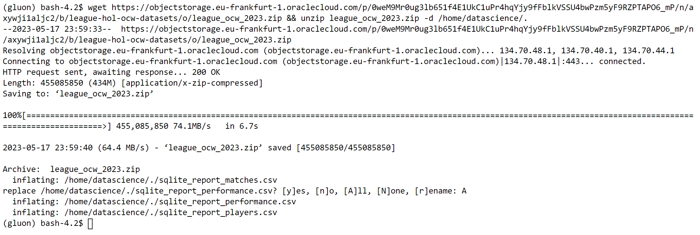
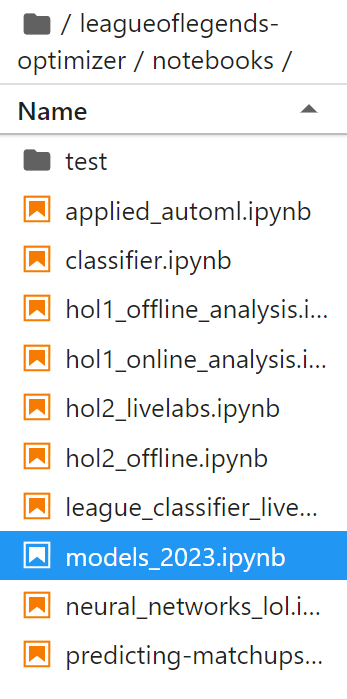

# Infrastructure

## Introduction

In this lab, we will build the infrastructure that we will use to run the rest of the workshop.

The main four elements that we will be creating are:

- **Compute** instance using a Linux-based image from Oracle Cloud.
- **Autonomous JSON Database** where we'll allocate the JSON documents.
- **Data Science** session and notebook, to experiment with the newly-generated data using notebooks.

Estimated Time: 15 minutes


We will use Cloud Shell to execute `start.sh` script, which will call Terraform and Ansible to deploy all the infrastructure required and setup the configuration. If you don't know about Terraform or Ansible, don't worry, there is no need.

- Terraform is an Open Source tool to deploy resources in the cloud with code. You declare what you want in Oracle Cloud and Terraform make sure you get the resources created.
- Ansible is an Open Source tool to provision on top of the created resources. It automates the dependency installation, copies the source code, and config files so everything is ready for you to use.

Do you want to learn more? Feel free to check the code for terraform and ansible after the workshop [in our official repository.](https://github.com/oracle-devrel/leagueoflegends-optimizer/)

### Objectives

In this lab, you will learn how to:

- Use Oracle Cloud Infrastructure for your Compute needs
- Deploy resources using Terraform and Ansible
- Learn about federation, and what's necessary to authenticate a Terraform request
- Download the datasets we will use

### Prerequisites

- An Oracle Free Tier, Paid or LiveLabs Cloud Account
- Active Oracle Cloud Account with available credits to use for Data Science service.

## Task 1: Cloud Shell

First, we need to download the official repository to get access to all the code (Terraform and Ansible code for this step).

1. From the Oracle Cloud Console, click on **Cloud Shell**.
  

2. As soon as the Cloud Shell is loaded, you can download the assets to run this lab.

    ```bash
    <copy>git clone https://github.com/oracle-devrel/leagueoflegends-optimizer.git</copy>
    ```

3. The result will look like this
  

4. Change directory with `cd` to `leagueoflegends-optimizer` directory:

    ```bash
    <copy>
    cd leagueoflegends-optimizer
    </copy>
    ```

## Task 2: Deploy with Terraform and Ansible

1. You are going to create a file `.env.json` that contains variables for terraform. Including the Riot Games API Key. Run on Cloud Shell the following command:

    ```bash
    <copy>
    npx zx scripts/setenv.mjs
    </copy>
    ```

2. It will run a dependency check and right after ask for a compartment name. If you are in a trial, or brand new to Oracle Cloud, just leave it empty and type _ENTER_.
    > NOTE: If you want to deploy on a specific compartment, type the name (not the OCI ID) and the compartment will be used.

3. Then, the script will ask for the `Riot Games API Key`. Paste the API Key from the developer's Riot Games website.

4. The script will finished.
    

5. Terraform uses a file called `terraform.tfvars` that contains the variables Terraform uses to talk to Oracle Cloud and set up your deployment the way you want it. You are going to use a script that will ask you for information to create the `terraform.tfvars` file for you. Run on Cloud Shell the following command:

    ```bash
    <copy>
    npx zx scripts/tfvars.mjs
    </copy>
    ```

6. The script will create the `terraform.tfvars` file.
    

## Task 3: Start Deployment

1. Change directory to `dev`

    ```bash
    <copy>cd dev</copy>
    ```

2. Run the `start.sh` script

    ```bash
    <copy>./start.sh</copy>
    ```

3. The script will run and it looks like this.

    

4. Terraform will create resources for you, and during the process it will look like this.

    

5. Ansible will continue the work as part of the `start.sh` script. It looks like this.

    

6. The final part of the script is to print the output of all the work done.

    

7. Copy the ssh command from the output variable `compute`.

    

## Task 4: Check Deployment

1. Run the `ssh` command from the output of the script. It will look like this.

    ```bash
    <copy>ssh opc@PUBLIC_IP</copy>
    ```

2. In the new machine, run the python script `check.py` that makes sure everything is working.

    ```bash
    <copy>python src/check.py</copy>
    ```

3. The result will confirm database connection and Riot API works.

    

4. If you get an error, make sure the _`terraform/terraform.tfvars`_ file from the previous task contains the correct values. In case of any error, just run the _`start.sh`_ script again.

## Task 5: Setting up Data Science Environment

Once we have set up our Cloud shell to extract data, we also need to prepare a Data Science environment to work with the data once it's been collected.
To achieve this, we need to load this workshop's notebook into our environment through the official repository.

We now need to load our notebook into our environment.

1. Opening a **Terminal** inside the _'Other'_ section the console and re-downloading the repository again:

    

2. Then, we re-clone the repository:

    ```bash
    <copy>
    git clone https://github.com/oracle-devrel/leagueoflegends-optimizer.git
    </copy>
    ```

3. Install the conda environment specifying the Python version we want (you can choose between 3.8, 3.9 and 3.10)

    ```bash
    <copy>conda create -n myconda python=3.9</copy>
    ```

    

4. Activate the newly-created conda environment:

    ```bash
    <copy>
    conda activate myconda
    </copy>
    ```

5. Install conda dependencies, so our environment shows up in the Kernel selector:

    ```bash
    <copy>
    conda install nb_conda_kernels
    </copy>
    ```

6. Install Python dependencies:

    ```bash
    <copy>
    pip install -r leagueoflegends-optimizer/deps/requirements_2023.txt
    </copy>
    ```

> Note: make sure to accept prompts by typing 'y' as in 'Yes' when asked.

After these commands, all requirements will be fulfilled and we're ready to execute our notebooks with our newly created conda environment.

Once we execute any notebook in this Data Science environment, remember that we'll need to select the correct conda environment under the _Kernel_ dropdown menu.

## Task 6: Downloading DataSets

1. We now need to load our datasets into our environment. For that, we reuse the terminal we created in the previous step:
    

2. Then, we execute the following command, which will download all necessary datasets:

    ```bash
    <copy>
    wget https://objectstorage.eu-frankfurt-1.oraclecloud.com/p/FcwFW-_ycli9z8O_3Jf8gHbc1Fr8HkG9-vnL4I7A07mENI60L8WIMGtG5cc8Qmuu/n/axywji1aljc2/b/league-hol-ocw-datasets/o/league_ocw_2023.zip && unzip league_ocw_2023.zip -d /home/datascience/.
    </copy>
    ```

    

## Task 7: Accessing our Notebooks

1. We should now see the repository / files in our file explorer:

    

2. We navigate to the _`leagueoflegends-optimizer/notebooks/`_ directory and the notebook [_`models_2023.ipynb`_](https://github.com/oracle-devrel/leagueoflegends-optimizer/blob/livelabs/notebooks/models_2023.ipynb) is the one we will review during this workshop.

    

Let's open it. You may now [proceed to the next lab](#next).

## Acknowledgements

- **Author** - Nacho Martinez, Data Science Advocate @ DevRel
- **Contributors** - Victor Martin, Product Strategy Director
- **Last Updated By/Date** - July 24th, 2023
