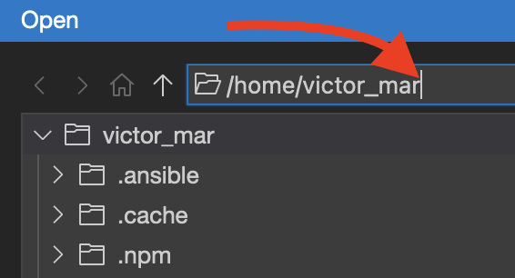
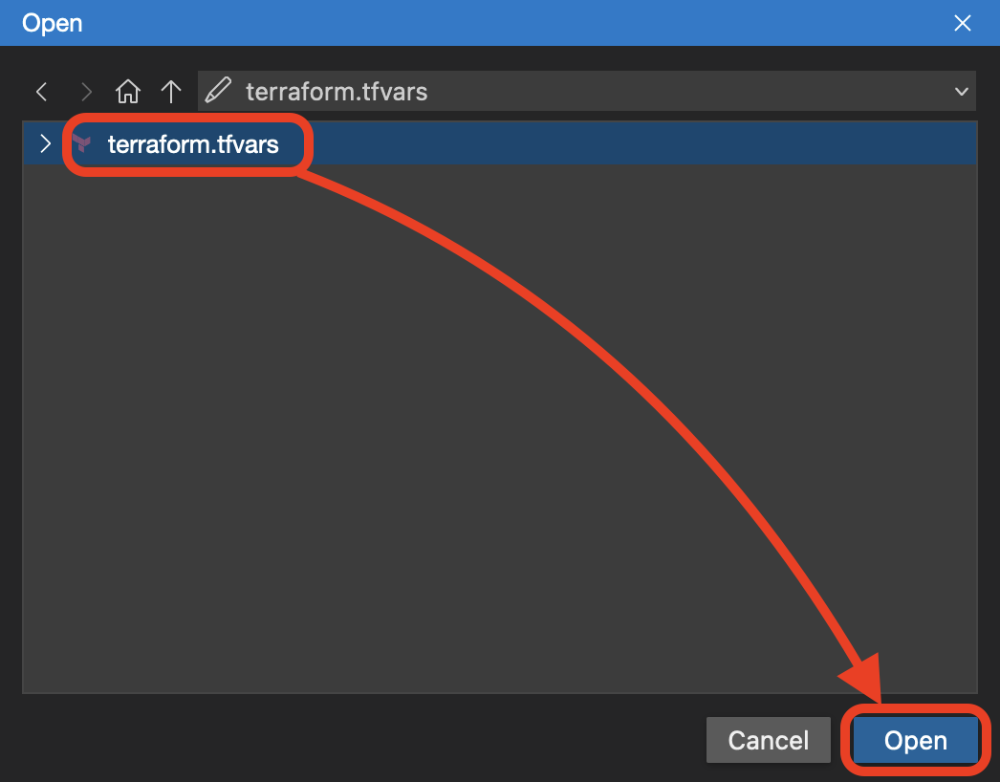
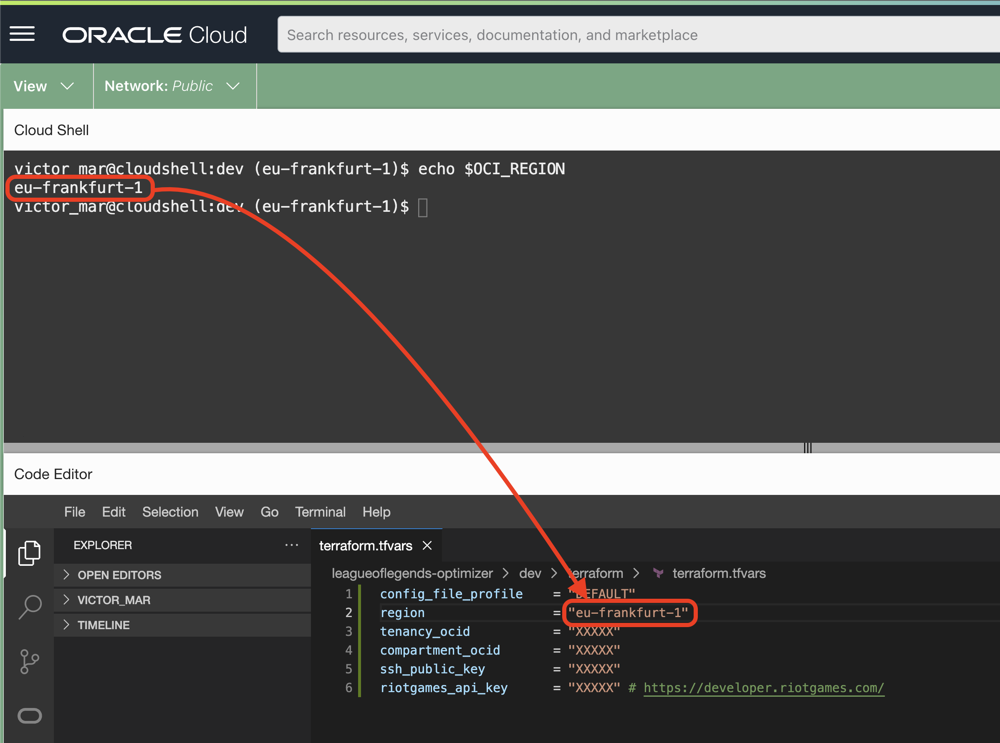
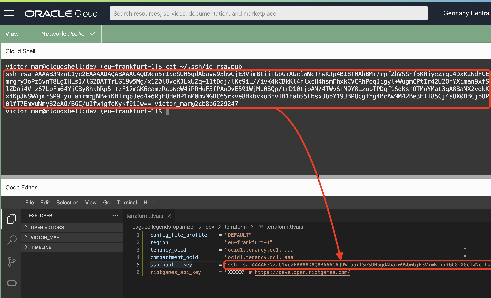
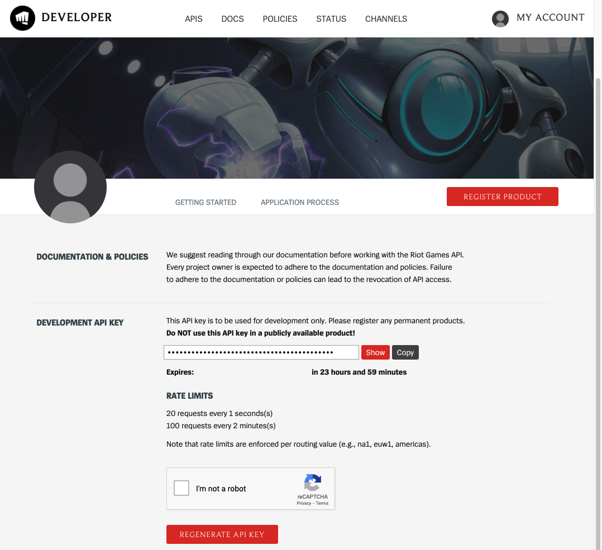
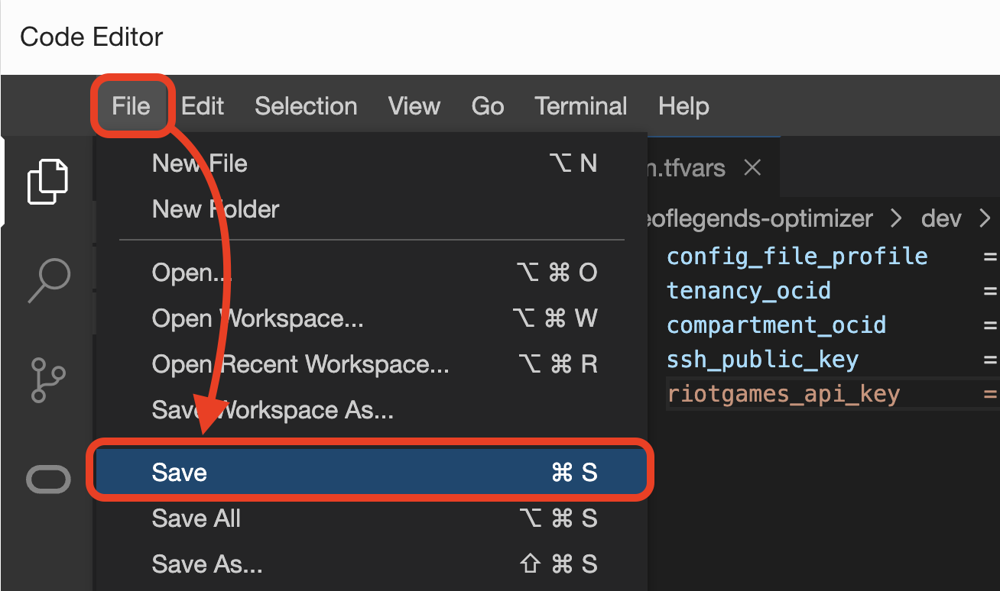
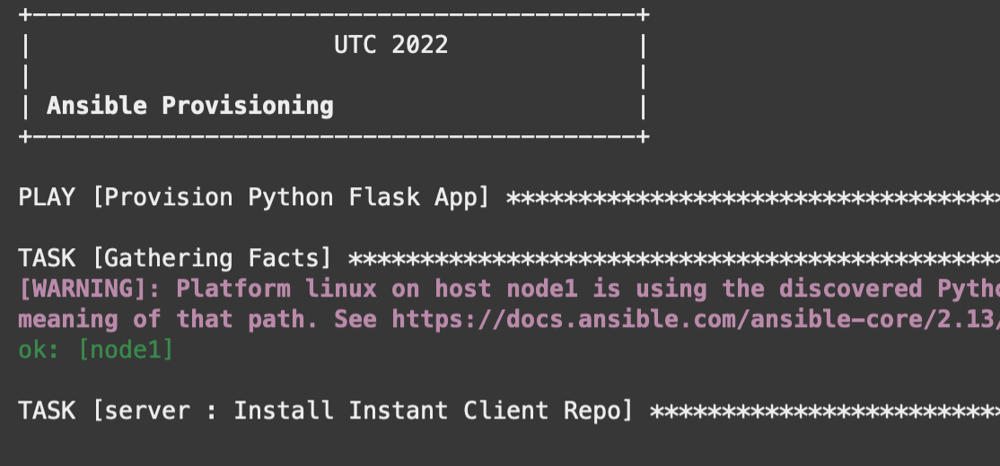
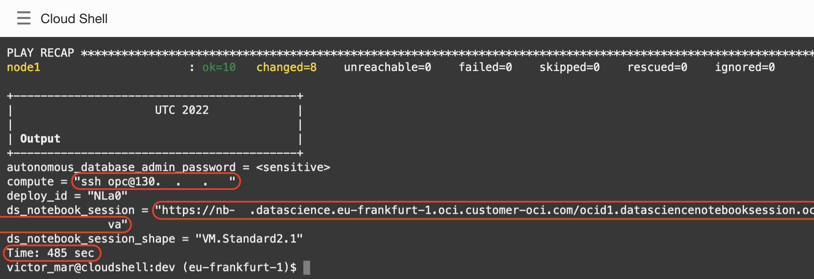
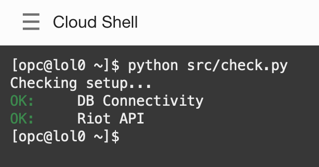

# Infrastructure

Estimated Time: 15-20 minutes

## Introduction

In this lab we will build the infrastructure that we will use to run the rest of the workshop.

The main four elements that we will be creating are:
- **Compute** instance using a Linux-based image from Oracle Cloud.
- **Autonomous JSON Database** where we'll allocate the JSON documents.
- **Data Science** session and notebook, to experiment with the newly-generated data using notebooks.


We will use Cloud Shell to execute `start.sh` script that will call Terraform and Ansible to deploy all the infrastructure required and setup the configuration. If you don't know about Terraform or Ansible, don't worry, there is no need.

Terraform is an Open Source tool to deploy resources in the cloud with code. You declare what you want in Oracle Cloud and Terraform make sure you get the resources created.

Ansible is an Open Source tool to provision on top of the created resources. It automates the dependency installation, copies the source code, and config files so everything is ready for you to use.

Do you want to learn more? Feel free to check the code for terraform and ansible after the workshop.


### Prerequisites

* An Oracle Free Tier, Paid or LiveLabs Cloud Account
* Active Oracle Cloud Account with available credits to use for Data Science service.


## Task 1: Cloud Shell

1. From the Oracle Cloud Console, click on **Cloud Shell**.
  

2. As soon as the Cloud Shell is loaded, you can download the assets to run this lab.
    ```
    <copy>git clone --branch livelabs https://github.com/oracle-devrel/leagueoflegends-optimizer.git</copy>
    ```

3. The result will look like this
  


4. Change directory with `cd` to `leagueoflegends-optimizer` directory:
    ```
    <copy>cd leagueoflegends-optimizer/dev</copy>
    ```

5. Terraform uses a file called `tfvars` that contains the variables Terraform uses to talk to Oracle Cloud and set up your deployment the way you want it. You are going to copy a template we provide to use your own values. Run on Cloud Shell the following command:
   
    ```
    <copy>
    cp terraform/terraform.tfvars.template terraform/terraform.tfvars
    </copy>

    ```


## Task 2: Deploy with Terraform and Ansible

1. Click on **Code Editor**. Next to the Cloud Shell one.
    

    > **Note**: for **Safari** users:<br>
    > First, it is not the recommended browser for OCI. Firefox or Chrome are fully tested and are recommended.<br>
    > With Safari, if you get a message _Cannot Start Code Editor_, go to _**Settings** > **Privacy**_ and disable _**Prevent cross-site tracking**_.<br>
    > Then open Code Editor again.

2. On the **Code Editor**, go to _**File** > **Open**_.
    

3. On the pop-up, edit the path by clicking the pencil icon:
    

4. Append, at the end, the path to the `terraform.tfvars`
    

    ```
    <copy>/leagueoflegends-optimizer/dev/terraform/terraform.tfvars</copy>
    ```

5. Type _[ENTER]_ to select, click on the `terraform.tfvars` file and click Open.

    

6. The file will open and you can copy values you will get from running commands on Cloud Shell and paste it on the Code Editor.

7. Copy the output of the following command as the region:

    ```
    <copy>echo $OCI_REGION</copy>
    ```

    

8. Copy the output of the following command as the tenancy OCID:

    ```
    <copy>echo $OCI_TENANCY</copy>
    ```

    

9. Copy the output of the same command as the compartment OCID:

    ```
    <copy>echo $OCI_TENANCY</copy>
    ```

    

    > **Note**: for experienced Oracle Cloud users:<br>
    > Do you want to deploy the infrastructure on a specific compartment?<br>
    > You can get the Compartment OCID in different ways.<br>
    > The coolest one is with OCI CLI from the Cloud Shell.<br>
    > You have to change _`COMPARTMENT_NAME`_ for the compartment name you are looking for and run the command:

    > ```
    ><copy>
    oci iam compartment list --all --compartment-id-in-subtree true --query "data[].id" --name COMPARTMENT_NAME
    </copy>
    > ```

10. Generate a SSH key pair, by default it will create a private key on _`~/.ssh/id_rsa`_ and a public key _`~/.ssh/id_rsa.pub`_.
    It will ask to enter the path, a passphrase and confirm again the passphrase; type _[ENTER]_ to continue all three times.

    ```
    <copy>ssh-keygen -t rsa</copy>
    ```

    > **Note**: If there isn't a public key already created, run the following command to create one:
    > ```
    > <copy>ssh-keygen</copy>
    > ```
    > And select all defaults. Then, try running the command again.

11. We need the public key in our notes, so keep the result of the content of the following command in your notes.

    ```
    <copy>cat ~/.ssh/id_rsa.pub</copy>
    ```

    

12. From the previous lab, you should have the Riot Developer API Key.

  

  Paste the Riot API Key on the `riotgames_api_key` entry of the file.
  
  

13. Save the file.

    

## Task 3: Start Deployment

1. Run the `start.sh` script

    ```
    <copy>./start.sh</copy>
    ```

2. The script will run and it looks like this.

    

3. Terraform will create resources for you, and during the process it will look like this.

    

4. Ansible will continue the work as part of the `start.sh` script. It looks like this.

    

5. The final part of the script is to print the output of all the work done.

    

6. Copy the ssh command from the output variable `compute`.

    

## Task 4: Check Deployment

1. Run the `ssh` command from the output of the script. It will look like this.

    ```
    <copy>ssh opc@PUBLIC_IP</copy>
    ```

2. In the new machine, run the python script `check.py` that makes sure everything is working.

    ```
    <copy>python src/check.py</copy>
    ```

3. The result will confirm database connection and Riot API works.

    

4. If you get an error, make sure the _`terraform/terraform.tfvars`_ file from the previous task contains the correct values. In case of any error, just run the _`start.sh`_ script again.


You may now [proceed to the next lab](#next).

## Acknowledgements

* **Author** - Nacho Martinez, Data Science Advocate @ DevRel
* **Contributors** - Victor Martin, Product Strategy Director
* **Last Updated By/Date** - April 20th, 2023