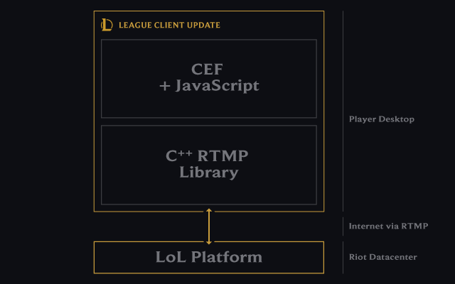
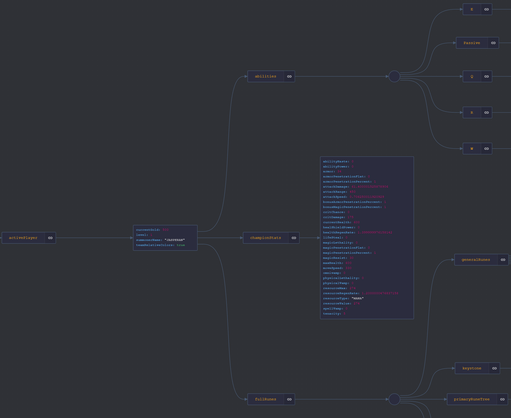
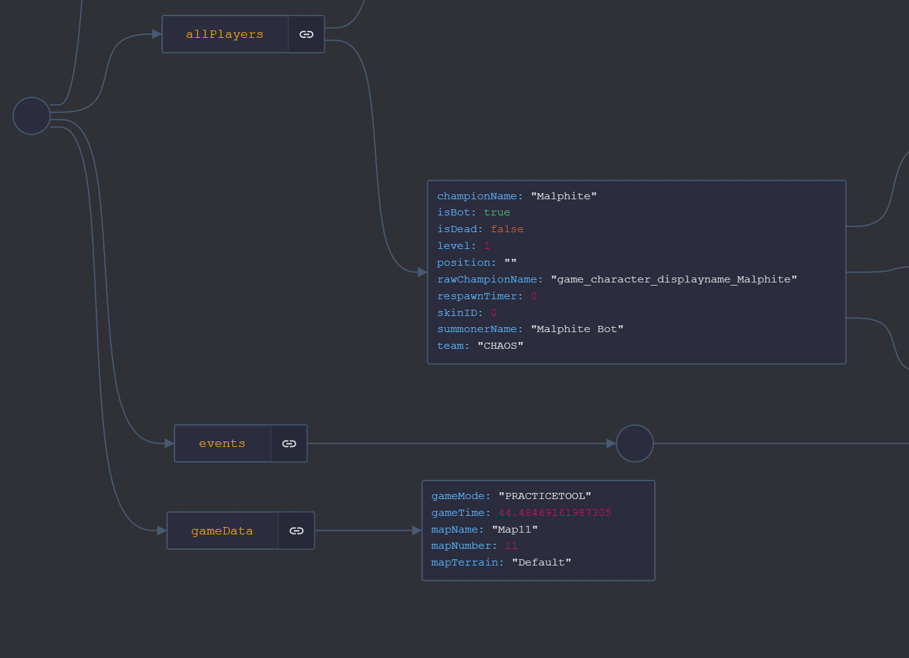
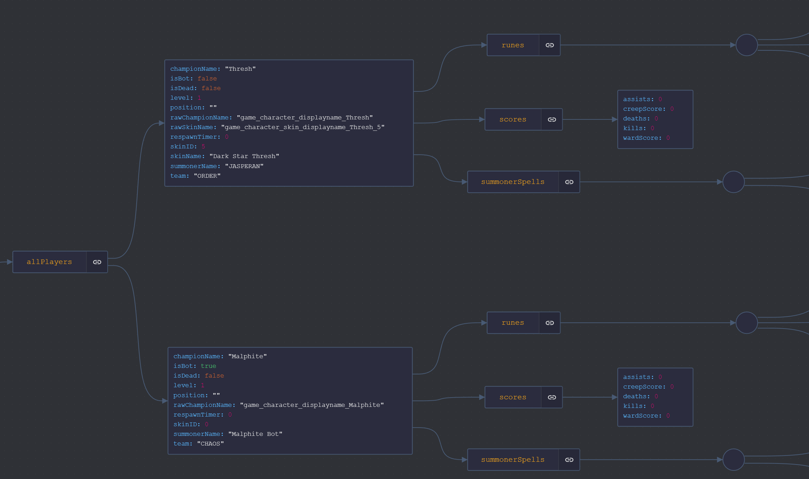
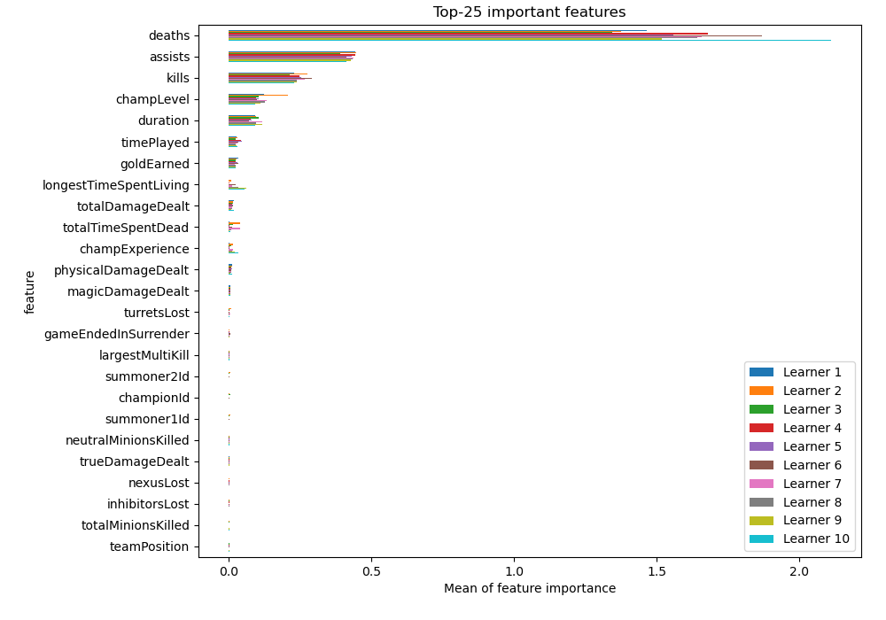
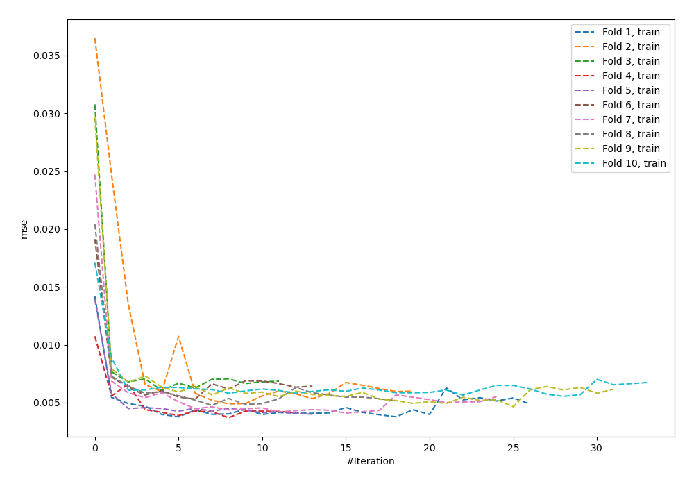
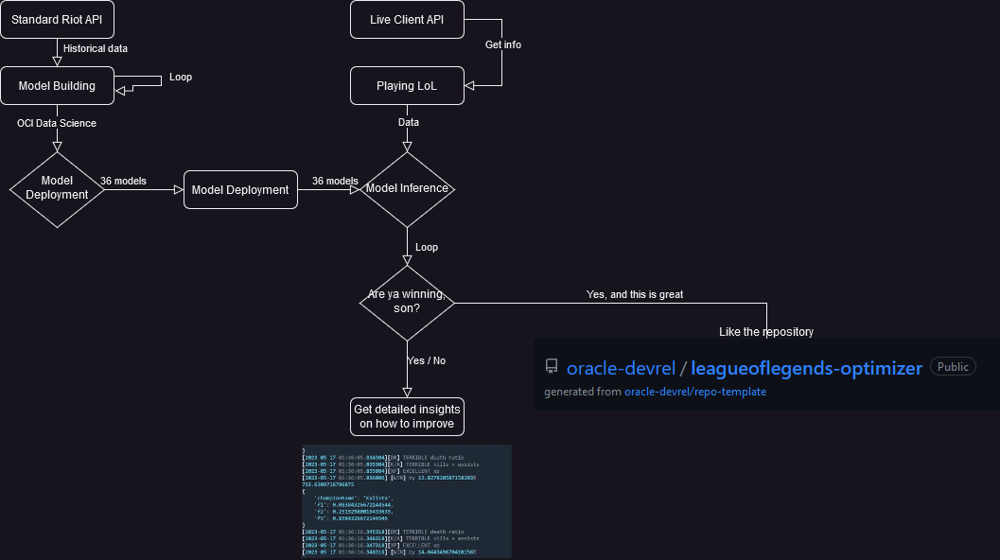
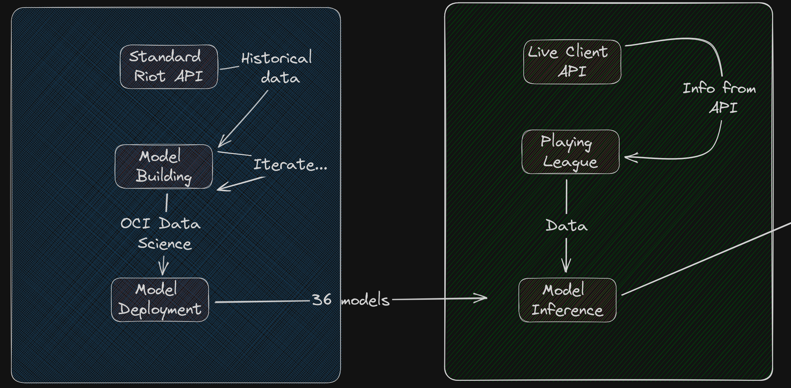
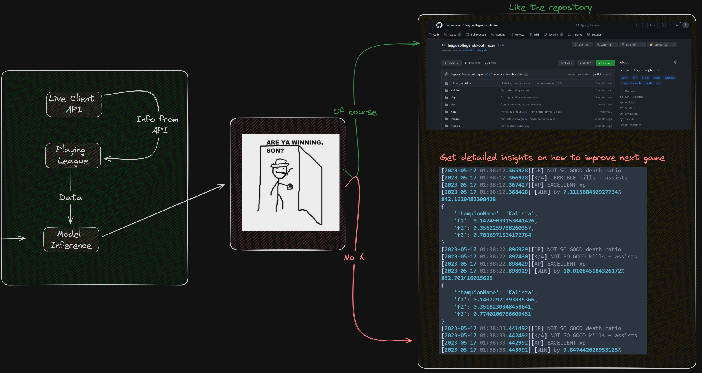

# How to think like a Machine for Data Science

## Introduction

In this chapter, I'm going to explain how the thought process of a Data Scientist (me) tried to architect the Machine Learning portion of this workshop before getting into developing code, focusing on ideating the problem and analyzing available variables and insights.

I recommend you pay special attention to this lab if you are often afraid of starting to solve a problem, or are unsure of how to begin.

Estimated Time: 20 minutes

### Objectives

In this lab, you will learn how to:

* Learn how to start working on an ML problem
* Architect the problem and data structures
* Find target variables
* Explore the dataset with AutoML tools
* Get our code ready to create some ML pipelines that can be reused in the future for other types of problems

### Prerequisites

* An [Oracle Free Tier](https://signup.cloud.oracle.com/?language=en&sourceType=:ow:de:ce::::RC_WWMK220210P00063:LoL_handsonLab_optimizer&intcmp=:ow:de:ce::::RC_WWMK220210P00063:LoL_handsonLab_optimizer), Paid, or LiveLabs Cloud Account
* Active Oracle Cloud Account with available credits to use for Data Science service.

## Task 1: What Data can I get and how?

### Standard League API

The [League API](https://developer.riotgames.com) is where we need to look first. The data on the API is constantly evolving and new endpoints (or even the same endpoints) are being published or improved by Riot Games.

This is very useful for us, as more and more data is becoming available in newer API endpoints.

To demonstrate the huge difference that has been achieved throughout previous versions of this workshop, we used to have the following data structures for our models:


However, we have much more vast amounts of information present in a newer endpoint nowadays:


> **Note**: the difference is so huge the new data doesn't even fit in a 4K screen

This allows our datasets to be much richer, and in turn, lets our Machine Learning models learn faster, more efficiently, and create a wider variety of models.

### Live Client API

Regarding the Live Client API (a specific API that allows us to extract `live` real-time data about any match that we might be playing), the structure hasn't changed a lot.



> **Note**: Communication between libraries **happens automatically when we run the program**. Since we're running the League client in our computer, the IP being used is localhost `(127.0.0.1)`. If you're interested in seeing how this communication works in more detail, check out [this link](https://developer.riotgames.com/docs/lol).

This is the kind of data that we extracted last year:


> **Note**: this data focused on the `championStats` object and used champion statistics (like armor, ability power...), which didn't allow for much flexibility

Compared to this year's data, which kind of stays with the same characteristics:



However, we also consider some other variables from other structures that we previously didn't, like `gameTime`, `level` and `scores`:




Note that the amount of information present in the Live Client API is much more limited than the info we can find in the standard League API. Since we have such a disparity in the number of stats and variables that can be extracted, we will need to be mindful of which variables to use if we want to "join" both datasets.

Ideally, we'd want our more complex model to aid in the training process of our smaller, real-time model. Since we have much more data for the big model, we can use this strategy to train the model with millions of examples, and then perform inference on the smaller model.

At the end of the process, we will have a "real-time companion" that will tell us how well we're playing a specific champion. For that we will need to calculate a specific player's performance.

## Task 2: Full Comparison

Between last year and this year, we have made the following progress:

_**Last year**_'s models? A bit messy:

* Used 24 variables
* Analyzing 50,000 Masters+ players
* Examining 200,000 Masters+ games
* Gaining 1,288,773 matchup insights 📊
* 3 models in total, but we didn't calculate a player's performance
* **Win Prediction Model** 🏆: struggling at 65% accuracy 🎯

But _**this year**_, we leveled up:

* Now ⚡ using 107 variables ⚡
* Analyzing 71,447 Masters+ players 🎮
* Examining 3,260,537 Masters+ games 🕹️
* Gaining 3,827,781 performance insights 💡😵
* 12 model types (**36** models in total) 🚀
* **Performance Calculator Model**: R^2^ (coefficient of determination) of **99.99%**, RMSE of **0.321** 📈
* **Win Prediction Model** 🏆: **99.32%** accuracy (with a few hours of training)

### New Issue Detected in Riot Games API

Compared to last year, a new error (and important) was detected: there are some API calls that return different types of data.

For example:

* Match `LA1_1258959236` returns 107 variables in total
* Match `EUN1_3292157187` returns 125 variables, from which only 107 are going to be used
* Some other matches return a different amount of variables, between 107 and 125. I suspect this has to do with when the match was played. I checked that the issue doesn't only happen in some regions, it's global.

When problems like these arise, we need to work around these incosistencies and harmonize our dataset (in this case, harmonize the data extraction process). You can find out how I've performed harmonization [in these lines of code](https://github.com/oracle-devrel/leagueoflegends-optimizer/blob/livelabs/src/process_performance.py#L167).

## Task 3: Calculating Player's Performance

Now that we have a harmonized dataset, we're ready to calculate a player's performance. But how do we begin? For that, I like to use an AutoML tool called [mljar-supervised](https://github.com/mljar/mljar-supervised), that allows me to easily perform some automatic analysis for the dataset to predict the `win` variable (already provided by the API and present in our dataset). I can launch an experiment like this:


> **Note**: Check out more information about the parameters I've used [here.](https://supervised.mljar.com/)

This generated a lot of visualizations for me, that gave me an idea of what's necessary to accurately predict the `win` (and `calculated_player_performance`) variable:

* For example, in my generated FastAI Neural Network Model (one of the models with the highest accuracy), I got to see the most important variables:



* It's also important, if taking decisions to see whether this model's performance is good or not. In our case, 



We can see that the loss of our ML model is low enough for our model to have taken the correct approach to predict the target variable. We can confirm that the model is telling us the most important variables by checking other models' predictions as well.

As we can see, the model is able to deduce whether we're going to win or not by just looking at four or five weighted variables. By comparing these stats to what we already have in the Live Client API, we'll determine which variables we can use from that data structure to arrive at the conclusion.

Considering that we're working with time-dependent data, from the variables mentioned above, we can extract the same statistics (deaths, kills)... per minute. This will introduce the time dimension into our dataset:

* deaths/min
* champLevel/min
* assists/min
* kills/min
* duration (which is inferred into the above 4 variables already by adding it in the denominator as a factor of the variables).

From these variables, and for each one of our matches, our Data Extraction pipeline is robust enough so that, any time you download a new match using our repository, all these additional variables will be calculated for us. More specifically, if you look at the dataset, you will see some variables called `f1...f5` which represent:

* f1: `deaths_per_min` (deaths/min),
* f2: `k_a_per_min` (kills+assists/min),
* f3: `level_per_min` (xp/min),
* f4: `total_damage_per_min` (**NOT** present in Live Client API yet -> not used),
* f5: `gold_per_min` (**NOT** present in Live Client API yet -> not used),

According to [this Medium post](https://maddcog.medium.com/measure-league-of-legends-performance-with-this-game-grade-778c2fe832cb), the optimal game grade / player performance is calculated with this formula:

```bash
<copy>
Game Grade = 0.336 — (1.437 x Deaths per min) + (0.000117 x gold per min) + (0.443 x K_A per min) + (0.264 x Level per min) + (0.000013 x TD per min)
</copy>
```

> **Note**: a game grade closer to 1 means the player had a ‘winning’ performance, while a grade closer to 0 equated to a ‘losing performance’.

This can also be updated with our models, by taking the standardized coefficients for each one of these variables' importances, and create our formula.

Adding creep score per minute didn't offer them any improvement to the model so I chose to ignore it as well. However, only using Diamond matches in their training dataset increased the accuracy by 3% in the end. This is good for us as we've only considered Masters+ games in our training dataset with the hopes of reducing variability in our data.

As a conclusion, there is no noticeable improvement by adding variables (eg. creep score) or making the model more specific. Therefore, the simpler, generic model is what we'll aim for. So, we'll take the abovementioned variables (only three out of the five are present in the Live Client API) and build a new model from it:

* Input variables: deaths/min, kills+assists/min, xp/min.
* Output variables: model 1 will predict the `win` variable and model 2 will predict `calculated_player_performance` for any given player.

## Task 4: Conclusion

Now that we have things clear:

* How many models we want to build
* Inputs / outputs of each model
* Expected RMSE, accuracy for each one of the models

And the fact that we have some additional model explainability thanks to `mljar-supervised`, **NOW** we're ready to begin building our models / a pipeline in OCI Data Science. 

In order to build these models, we will also use AutoML, but a different tool. The tool you choose, in the end, must be parametrizable enough so that, if I'm unhappy with what's provided by default (like default hyperparameters) I still have enough control over the implementation of the AutoML library to be able to modify them to my convenience.

And, to finalize, the flow of our problem shall be something like this:



Here's the diagram broken down into two steps:





And **now**, it's time to keep extracting data periodically, to improve the quality of our dataset, and start building the model.

You may now [proceed to the next lab](#next).

## Acknowledgements

* **Author** - Nacho Martinez, Data Science Advocate @ DevRel
* **Contributors** - Victor Martin, Product Strategy Director
* **Last Updated By/Date** - July 24th, 2023
